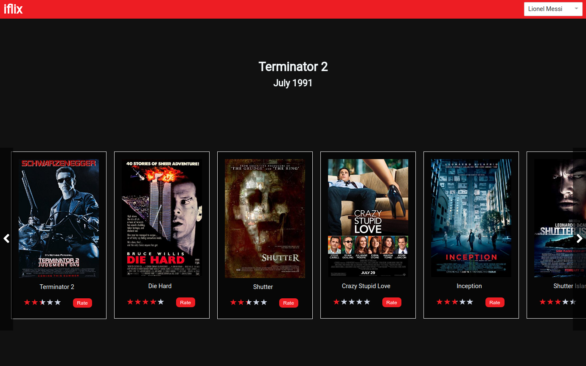
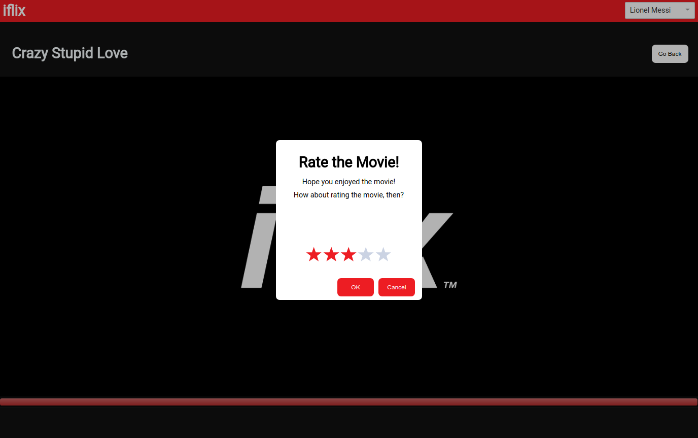

# iflix fullstack

  - [Quick Start](#quick-start)
  - [Back End](#back-end)
  - [Front End](#front-end)


## Dependencies

Node 8.2.1

## Quick Start

```bash
# Clone the repository
git clone 

# Go inside the directory
cd iflix-rating-fullstack

# Install dependencies
npm install

# Start server
npm start

# Wait for data seeding
Console should read like this:
    Starting up mongod service... (MongoMemoryServer)
    MongoDB successfully connected to mongodb://localhost:41934/iflix_db1
    Seeding data...
    Seeding User data... (async)
    Seeding Content data... (async)
    Seeding Rating data... (async)
    Seeding complete.
    Listening on port 8080!
    Server ready!


#Start client once seeding is complete  
npm run client
```


## Back End

### Technologies
 - MongoDB
 - Node.js
 - Express

### Design

`mongodb-memory-server` is used to quickly spin up a actual/real MongoDB Server programmatically from node for testing and *demonstration* purpose. 

Basically there are 3 models, the User, the Content and the Rating.

Content Schema
```
{
   _id : ....,
   title: ....,
   ....
   rateCount : 0,
   rateValue : 0,
   average: 0
}
```

Rating Schema
```
{
    _id: ....,
    userId: ....,
    contentId:....,
    value: ..., 
    dateAdded:....   
}
```

`userId` and `contentId` properties are set with index to true to allow 
quick find on whether aa user has rated a content before or not.

If a content has not been rated before by a particular user, the new rating document to Rating collection will be 
inserted and the content will be updated on the properties `rateCount` and `rateValue`. 
The average is calculated here (`project requirement`) although the client can make use of the `rateValue` and `rateCount` to get the average as well, thus saving
another operation on the server side.  

Fake data is seeded for demonstration purposes. 

Data of each model are consumed from the following API endpoints below.

#### API Endpoints
```
Get all users
- GET /api/v1/users/
 
Get single user   
- GET /api/v1/users/[userId]
 
Get all contents
- GET /api/v1/contents/
 
Get single content by content Id
- GET /api/v1/contents/[contentId]
 
Get single content by contend Id ( project requirement )
- GET /api/v1/rating/[contentId]
 
Get a single rating based on content Id and user Id
- GET /api/v1/rating/?contentId=[contentId]&userId=[userId]
 
Post a rating ( project requirement )
- POST /api/v1/rating/

```

#### Appropriate Error Handling
 - Failed requests return appropriate HTTP error codes.


## Front End

### Technologies
 - React
 - Redux
 - styled-components
 
 
### Design


For demonstration purposes, application starts up loading the content browsing page with account owner already logged in.
Multiple account users seeded to demonstrate the use case on whether an user has already rated a movie before. ( `project requirement`) 

On the top left corner, there is a drop down where user can switch account users.  
Movies are presented in a wide horizontal panel which is scrollable by clicking the Left (<) and Right(>) buttons.

When user hovers over a movie, a play icon should appear. User can click on the movie to watch it. Once the play ends (about 3 secs),
a pop up will appear for user to give a rating from 1 to 5 stars. If user has rated before, the pop up will mention it and prevent user from rating.
Try different user and movie combinations! Data is seeded randomly. 

Each movie thumbnail on the browsing page also presents users a button to give a rating. This is intended for users to decide to rate other times.

After giving a rating, the average will be shown on the same pop up.

### Appropriate Error Handling
 - When server is down, main page displays message that 'Service is down'.
 - When user submits a rating and fail, the pop up modal will say submit failed.
 - Input error message appears when user tries to submit 0 stars.

 
## Test
 
### Technologies
  - Supertest
  - AVA
  - Enzyme
  
  

### To run tests


 ```
 npm test
 ```
 
 This does not test everything due to time constraints. 
 
 `Back End` The crucial part, API calls were targeted on the back end.
 TDD approach was used on the back end API calls, writing up the test first then implementing the route controllers.
 
 `Front End` Tests were written after implementation. Tests were written for the Redux reducers and actions.
 The UI component tests are very limited, only a couple of validation that elements exist. 
 Behaviour tests including clicking buttons were done manually unfortunately. 
 
 
## Future Improvements


 - More testing especially the behavioural aspect of the UI.
 
 
## Screenshots

 


 
 
## Author

Boon Hui Tan 
